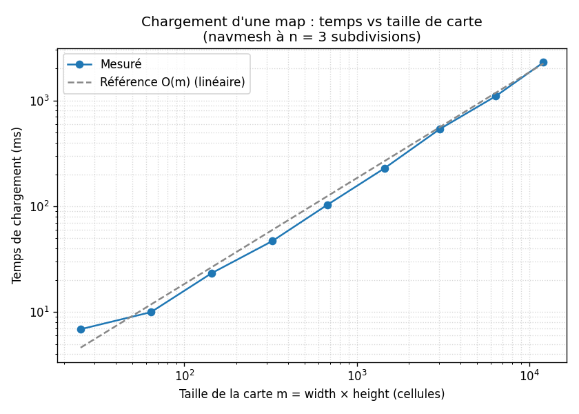
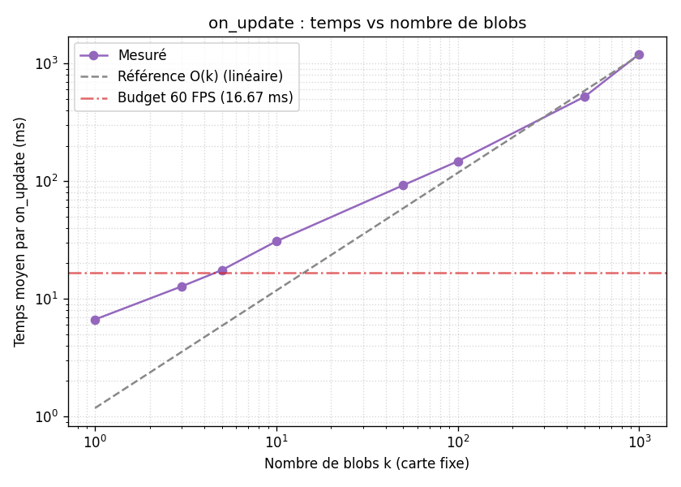

# Fichier design

## Modules et classes

### `map_types.py`

Contient uniquement des types de données : enums et dataclasses. Il est entièrement découplé d'Arcade.

- **`GridCell`** (Enum) : représente chaque type de cellule possible sur la grille (`GRASS`, `BUSH`, `CRYSTAL`, `BLOB`, `GATE`, etc.). L'usage d'un `Enum` garantit que seules les valeurs valides existent, et permet le pattern matching exhaustif.
- **Dataclasses** (`SwitchConfig`, `GateConfig`, `TeleporterConfig`, `KeyConfig`, `ChestConfig`, `ParsedHeader`) : structures de données immuables qui transportent la configuration lue depuis le fichier de carte.
- **`InvalidMapFileException`** : exception pour signaler une carte invalide au moment du chargement.

**Méthodologies** : Séparation entre données et comportement. Les dataclasses `frozen=True` garantissent l'immutabilité des configurations après chargement. L'`Enum` pour `GridCell` évite les chaînes de caractères magiques et rend le code plus sûr.

---

### `map_parser.py` — Parsing et validation

Responsable de transformer un fichier texte en structures de données Python. Utilise `ruamel.yaml` pour la section YAML (pour les interrupteurs, portails, téléporteurs, clés et coffres) et parcourt les lignes de la carte caractère par caractère.

Fonctions :
- `parse_header` : extrait les métadonnées YAML (dimensions, listes d'entités).
- `build_grid` : construit la grille de cellules à partir des caractères de la carte.
- `parse_switches / parse_gates / parse_teleporters / parse_keys / parse_chests` : valident et convertissent chaque liste d'entités.
- `validate_formula / evaluate_formula` : gèrent les formules logiques récursives (`and`, `or`, `not`, `switch_is_on`) pour les conditions d'ouverture des portails.

**Méthodologies** : Les erreurs sont signalées au chargement avec `InvalidMapFileException`, pas à l'exécution. La récursion bornée dans `validate_formula` protège contre les formules infiniment imbriquées. Ce module est entièrement indépendant d'Arcade, ce qui le rend testable sans fenêtre graphique.

---

### `map.py` — Représentation immuable de la carte

La classe `Map` est la représentation immuable de la carte chargée. Elle stocke la grille, la position de départ du joueur, et toutes les configurations d'entités.

**Encapsulation** : tous les attributs sont privés et exposés uniquement en lecture via des `@property`. Rien à l'extérieur ne peut modifier une `Map` après sa construction.

**Validation** : les méthodes `_validate_entity_positions` et `_validate_entity_group` vérifient la cohérence entre la grille et les configurations : chaque cellule spéciale a bien une config, et vice versa. Cette vérification se fait à la construction, pas à l'usage.

**Méthodes de fabrique** : `Map.from_file` et `Map.from_string` permettent de construire une `Map` depuis un fichier ou une chaîne. Cela dissocie la construction et la représentation et facilite les tests (on peut passer une string directement).

Fonctions utilitaires associées :
- `spinner_bounds` : calcule les bornes de déplacement d'un spinner en parcourant la grille. C'est fait indépendamment d'Arcade, donc c'est testable.
- `bat_bounds` : calcule le centre et le rayon de la zone d'une chauve-souris.

**Méthodologies** : Encapsulation stricte (attributs privés, interface publique minimale). Immutabilité : la carte ne change jamais après chargement, ce qui simplifie le raisonnement sur l'état du jeu. Séparation de la construction et de la représentation.

---

### `level.py` — Construction du monde graphique

La fonction `build_level` transforme un `Map` (données abstraites) en un `Level` (sprites Arcade prêts à être affichés). Elle itère sur chaque cellule de la grille et crée les sprites correspondants, ainsi que les objets logiques associés (ennemis, navmesh, etc.).

La dataclass `Level` regroupe toutes les `SpriteList` et listes d'objets du monde. Elle expose `remove_enemy_sprite` pour retirer un ennemi tué sans casser les références croisées.

**Méthodologies** : Séparation entre données (`Map`) et représentation graphique (`Level`). La construction est isolée dans une fonction dédiée `build_level`, ce qui permet de réinitialiser le jeu en recréant simplement un `Level` à partir du même `Map` immuable.

---

### `enemies.py` — Hiérarchie des ennemis (utilisation de polymorphisme)

Définit une abstractmethod commune pour tous les ennemis.

- **`Enemy`** : classe abstraite avec une seule méthode `update`.
- **`EnemyUpdateContext`** (dataclass frozen) : regroupe les informations nécessaires à la mise à jour d'un ennemi (joueur, murs pour la ligne de vue, état du pouvoir fantôme). C'est un objet de contexte passé à chaque `update`, ce qui évite de passer de nombreux paramètres séparés.
- **`SpinnerEnemy`** et **`BatEnemy`** héritent toutes les deux de **`Enemy`** et implémentent `update`, ainsi que leurs méthodes respectives.

**Méthodologies** : Polymorphisme via la classe abstraite `Enemy`. Le `GameView` appelle `enemy.update(context)` sur tous les ennemis sans distinguer leurs types. Donc il est possible d'ajouter un nouveau type d'ennemi sans modifier `GameView`.

**Question de design (semaine 4 — Chauves-souris)** : Comment gérez-vous le fait que vous avez maintenant deux types de monstres, avec des comportements différents ?

Réponse : via la classe abstraite `Enemy` et le polymorphisme. Chaque type d'ennemi implémente `update` à sa façon. Ajouter un troisième monstre (le blob) n'a nécessité aucune modification de `GameView` : il suffisait de créer une nouvelle classe qui hérite de `Enemy`.

---

### `blob.py` — Blob (pathfinding)

- Patrouille aléatoirement parmi une liste de destinations possibles (`build_possible_destinations`), calculée une seule fois au chargement à partir de la `Map`.
- Si le joueur est visible (ligne de vue non bloquée via `arcade.has_line_of_sight`, distance max de 5 tiles), le blob le prend pour destination.
- Utilise `find_path` (Dijkstra via NetworkX) pour calculer un chemin sur le navmesh, puis avance waypoint par waypoint.

**Méthodologies** : Séparation entre comportement (`BlobEnemy.update`) et infrastructure de navigation (`navmesh.py`). Le blob ne connaît pas les détails du graphe, il délègue à `find_path`. Les destinations possibles sont précalculées, conformément à la consigne de ne calculer que ce qui ne change pas au chargement.

**Question de design (semaine 6 — Blobs)** :

*Qu'avez-vous choisi comme type de nœud `TypeNoeud` ?*

On utilise `tuple[int, int]` (alias `NodeType`). Un nœud est identifié par ses indices `(ix, iy)` dans la grille de sous-nœuds. C'est hashable (nécessaire pour NetworkX et les `set`) et ordonnable. La position pixel est calculée à la demande via `_node_pixel_position(ix, iy, n)`.

*À quel niveau traitez-vous la construction du navmesh ?*

Le navmesh est construit dans `level.py` au moment de `build_level`, puis passé à chaque `BlobEnemy` à la construction. Il est partagé (le même graphe NetworkX est réutilisé par tous les blobs), ce qui évite de le reconstruire plusieurs fois. Il n'est pas stocké dans `Map` car c'est une structure graphique dépendant d'Arcade (via `TILE_SIZE`), pas une donnée abstraite de carte.

*Pouvez-vous tester la construction du navmesh sans Arcade ?*

Oui. `build_navmesh` ne dépend que de `Map` et de constantes numériques, pas d'objets Arcade graphiques. On peut donc construire une `Map` depuis une string et appeler `build_navmesh` dans un test pytest ordinaire.

---

### `navmesh.py` — Navigation sur la carte

- `build_navmesh(game_map, n)` : subdivise chaque cellule en `n×n` sous-nœuds (avec `n` impair), élimine ceux à moins d'une distance `s` du centre d'un buisson, et connecte les nœuds voisins (8-connexité) avec un poids euclidien.
- `nearest_node` : trouve le nœud du graphe le plus proche d'une position pixel.
- `find_path` : utilise `nx.dijkstra_path` pour trouver le chemin optimal entre deux positions.

**Méthodologies** : Module à responsabilité unique. Le choix de NetworkX illustre la réutilisation de bibliothèques pour des algorithmes complexes (Dijkstra) plutôt que de les réimplémenter.

**Question de design (semaine 6)** : *Si vous avez n×n nœuds par cellule et une carte de taille m×m, quelle est la complexité ?*

- Construction du navmesh : `O(m² · n²)` nœuds à créer et connecter.
- Recherche de plus court chemin (Dijkstra avec tas binaire) : `O((V + E) · log V)` où `V = m² · n²` et `E ≈ 8V` (8-connexité), donc `O(m² · n² · log(m · n))`.
- `nearest_node` : `O(V) = O(m² · n²)` — c'est le facteur dominant à chaque frame pour chaque blob.

---

### `gate_system.py` — Interrupteurs et portails

`GateSystem` gère la logique des interrupteurs (on/off) et des portails (ouverts/fermés selon une formule logique).

- Maintient un dictionnaire `_switch_state_map` comme état interne (sprite → booléen).
- `toggle_switch` : inverse l'état d'un interrupteur et met à jour sa texture.
- `update` : réévalue tous les portails à chaque frame selon leurs formules (`evaluate_formula` de `map_parser`).
- `_set_gate_open` : synchronise la texture et l'appartenance aux listes `walls` / `gates`.

**Question de design (semaine 6)** : *Quelle structure de données utilisez-vous pour représenter les conditions d'ouverture des portails ?*

Les formules sont représentées comme des `dict` imbriqués, directement tels que parsés depuis le YAML. C'est une structure récursive naturelle pour représenter un arbre d'expression logique. `evaluate_formula` parcourt cet arbre récursivement par pattern matching.

*S'il y a n interrupteurs et m portails, quelle est la complexité à chaque frame ?*

Avec des formules simples (`switch_is_on` uniquement) : `O(m)`, on évalue une formule en `O(1)` par portail. Avec des formules composées de profondeur `d` : `O(m · d)`. La validation à la construction garantit que `d ≤ 20` (ou autre constante).

**Méthodologies** : Encapsulation de l'état des interrupteurs. La logique de formule est déléguée à `map_parser.evaluate_formula` (séparation des responsabilités). L'usage d'un `dict` comme clé dans `_switch_state_map` permet une lookup en `O(1)` grâce au haschage.

---

### `collision_system.py` — Détection des collisions

`CollisionSystem` centralise toute la logique de collision en un seul endroit, séparant la détection de la réaction.

- Retourne un `CollisionResult` (dataclass frozen) décrivant ce qui s'est passé : faut-il redémarrer ? Combien de points ? Téléportation ? Message de coffre ?
- Gère : chute dans les trous, collecte de cristaux, hits d'ennemis/interrupteurs/obstacles par les armes, ramassage de clés, ouverture de coffres, téléportation.

**Méthodologies** : Retour d'un objet résultat immuable plutôt que des effets de bord directs. `CollisionResult` décrit ce qui doit changer, c'est le `GameView` qui applique les changements. Ce découplage simplifie les tests et la lisibilité. L'usage de `use_spatial_hash=True` sur les `SpriteList` statiques (murs, trous, cristaux) rend les vérifications de collision en `O(1)` plutôt qu'en `O(n)`.

---

### `player.py` — Le joueur

`Player` hérite de `arcade.TextureAnimationSprite` et gère les entrées clavier, la physique et l'animation.

- Maintient l'état des touches pressées en attributs privés (`__right_pressed`, etc.).
- `update_physics(on_ice)` : implémente un système de vitesse avec friction différente selon la surface. Sur glace : accélération lente et haute inertie (`ICE_FRICTION = 0.03`). Sur sol : réponse instantanée (`GROUND_FRICTION = 1.0`).
- `__update_direction_and_animation` : met à jour la direction et l'animation selon les touches actives, en appliquant les règles de priorité définies dans les consignes (bas > haut > gauche > droite).

**Question de design (semaine 3 — Direction)** : *Comment définissez-vous le type `Direction`, et pourquoi ?*

`Direction` est un `Enum` avec `auto()`. Un `Enum` est préférable à des constantes entières ou des chaînes car : les valeurs valides sont bornées à la compilation, le pattern matching est exhaustif, et le code est auto-documenté.

*Ces méthodes reçoivent-elles un `symbol: int` ou un type plus spécifique ?*

Les méthodes publiques de `Player` reçoivent un `Direction`, pas un `int`. La conversion `symbol → Direction` est faite dans `GameView._direction_from_key` avant d'appeler `player.press_direction(direction)`. Ainsi, `Player` ne dépend pas du système de touches d'Arcade — il est plus facile à tester et plus réutilisable.

**Méthodologies** : Encapsulation des états internes. Séparation des responsabilités : `Player` gère la physique et l'animation, `GameView` gère la traduction des touches en directions.

---

### `weapon_base.py` et `weapon_system.py` — Armes (polymorphisme)

- **`Weapon`** : interface commune pour toutes les armes (`use`, `update`, `draw`, `is_active`, `check_collisions`, `on_hit`). Des méthodes optionnelles avec valeurs par défaut (`can_hit_enemies`, `can_toggle_switches`, `can_collect_crystals`, `can_hit_obstacles`) permettent à chaque arme de déclarer ses capacités sans forcer toutes les sous-classes à tout implémenter.
- **`SwordWeapon`** : Active pendant la durée de l'animation.
- **`BoomerangWeapon`** / **`Boomerang`** : L'état est géré par `BoomerangState` (Enum).
- **`WeaponSystem`** : gère le choix de l'arme active, dispatche les appels `update`/`draw`, et centralise la vérification des collisions selon les capacités de chaque arme.

**Question de design (semaine 3 — Boomerang)** : *Avez-vous défini une classe séparée pour le boomerang ?*

Oui. `Boomerang` hérite de `arcade.TextureAnimationSprite` pour bénéficier de l'animation et de la position dans le monde. `BoomerangWeapon` implémente `Weapon` et délègue à `Boomerang` pour les aspects graphiques. Cette séparation permet de tester la logique de `Boomerang` indépendamment du système d'armes.

*Comment gérez-vous les 3 états du boomerang ?*

Via `BoomerangState` (Enum : `INACTIVE`, `LAUNCHING`, `RETURNING`). L'Enum est préférable à des booléens ou des entiers car les états sont mutuellement exclusifs et nommés.

**Question de design (semaine 4 — Épée)** : *Comment gérez-vous le fait que vous avez maintenant deux types d'armes ? Pourriez-vous ajouter une troisième arme ?*

`WeaponSystem` contient un tuple de `Weapon`. Ajouter une troisième arme requiert seulement d'implémenter `Weapon` et de l'ajouter à ce tuple — sans modifier la logique de collision ou de dessin. Les méthodes `can_*` permettent une sélection déclarative des comportements sans `isinstance`.

**Méthodologies** : Polymorphisme. Ouvert à l'extension (nouvelles armes), fermé à la modification (pas besoin de changer `WeaponSystem`).

---

### `power_system.py` — Pouvoirs

- **`Power`** (ABC) : interface avec `on_activate`, `on_deactivate`, et `name`.
- **`GhostPower`** : rend le joueur semi-transparent (`alpha = 100`) et invincible aux ennemis.
- **`FreezePower`** : gèle tous les ennemis (leur `update` n'est plus appelé).
- **`PowerSystem`** : active un pouvoir aléatoire lors de l'ouverture d'un coffre, compte les frames restantes, et désactive le pouvoir à expiration.

**Méthodologies** : Chaque pouvoir est un objet interchangeable avec la même interface. `PowerSystem` ne connaît que `Power`, pas les sous-classes. Ajouter un pouvoir ne nécessite pas de modifier `PowerSystem`.

---

### `camera_controller.py` — Caméra

`CameraController` suit le joueur avec une marge (`margin_x`, `margin_y`) : la caméra ne bouge que si le joueur s'approche du bord de la zone visible. Elle est également limitée pour ne jamais montrer l'extérieur du monde.

**Méthodologies** : Responsabilité unique. La logique de caméra est entièrement isolée dans ce module, testable sans Arcade.

---

### Vues (`gameview.py`, `endgameview.py`)

- **`GameView`** : vue principale. Orchestre tous les systèmes, gère les entrées clavier, et délègue le rendu et la logique à chaque sous-système. Utilise deux caméras : une pour le monde (qui suit le joueur), une pour l'UI (fixe).
- `GameOverView` et `GameWinView` : vues simples affichant le résultat et permettant de relancer une partie.

**Méthodologies** : Le `GameView` joue le rôle de contrôleur : il coordonne sans implémenter et délègue tout aux autres modules et classes. La double caméra (monde + UI) permet d'afficher le score à une position fixe à l'écran indépendamment du déplacement du monde. Classe parent `EndGameView` dont `GameOverView` et `GameWinView` héritent.

---

## Analyse des performances

Complexité algorithmique du chargement d'une map
Facteur choisi : taille de la carte, exprimée en nombre de cellules m = width × height, avec n×n nœuds par cellule dans le navmesh.
Le chargement d'une map comprend deux grandes étapes : le parsing du fichier (géré par map_parser.py) et la construction du monde (build_level dans level.py). Le parsing est clairement O(m) : on parcourt chaque ligne et chaque caractère exactement une fois. Ce n'est pas l'étape intéressante.
L'étape dominante est la construction du navmesh dans build_navmesh. On crée jusqu'à m · n² nœuds candidats. Pour chacun, on vérifie s'il est trop proche d'un buisson en inspectant les 9 cellules voisines, ce qui est O(1). On connecte ensuite chaque nœud retenu à ses 8 voisins potentiels dans la grille de sous-nœuds, encore O(1) par nœud. La construction du graphe est donc O(m · n²).
La création des sprites dans build_level itère sur les m cellules de la carte pour créer les sprites correspondants : c'est O(m), largement dominé par la construction du navmesh dès que n > 1.
Le choix de n = 3 (valeur de BLOB_NAVMESH_SUBDIVISIONS) multiplie le nombre de nœuds par 9 par rapport à n = 1. C'est un compromis délibéré : un navmesh plus fin donne des trajectoires plus naturelles pour les blobs (ils ne collent plus aux murs en diagonale), au prix d'un chargement plus long.
La validation des entités de la carte (_validate_entity_positions dans map.py) est aussi O(m) grâce à l'usage de set pour stocker les positions vues : la vérification d'appartenance est O(1) au lieu de O(m) avec une liste. Sans ce choix, la validation serait O(m²).
En résumé, la complexité du chargement est dominée par O(m · n²), avec m la taille de la carte en cellules et n le nombre de subdivisions par côté de cellule.

Complexité algorithmique de on_update
Facteur choisi : le nombre de blobs k présents sur la carte. On raisonne à carte fixe, donc à nombre de nœuds de navmesh V = m · n² constant.
À chaque frame, on_update appelle successivement la physique du joueur, la mise à jour des ennemis, et la détection des collisions. Analysons les parties non triviales.
La mise à jour de chaque blob dans BlobEnemy.update peut déclencher un appel à _refresh_path, qui appelle find_path. Celui-ci contient deux étapes coûteuses. D'abord, nearest_node parcourt tous les nœuds du graphe pour trouver le plus proche : c'est O(V). Ensuite, nx.dijkstra_path exécute l'algorithme de Dijkstra avec un tas binaire : O((V + E) · log V) avec E ≈ 8V (8-connexité), soit O(V · log V). La recherche de chemin domine donc, avec O(V · log V) par blob et par frame où le chemin est recalculé.
En pratique, le chemin n'est recalculé que lorsque la destination change (arrivée à destination, ou détection du joueur). Cela limite les recalculs, mais dans le pire cas (blob qui suit le joueur en mouvement), le recalcul a lieu à chaque frame. Le terme O(V · log V) est donc un coût de pire cas. À l'inverse, has_line_of_sight est appelée à chaque frame pour chaque blob : bien que bornée par max_distance (donc indépendante de V), son coût constant élevé domine le temps réellement mesuré, comme le confirme le profiling plus bas. Dans les deux cas, à carte fixe, le coût par blob ne dépend pas de k, d'où une complexité linéaire en k.
La détection des collisions dans CollisionSystem est le point le plus intéressant. Les SpriteList statiques (murs, trous, cristaux, interrupteurs) sont construites avec use_spatial_hash=True. Grâce au hachage spatial, arcade.check_for_collision_with_list est O(1) au lieu de O(n) avec n le nombre de sprites dans la liste. C'est un gain critique : sans spatial hash, tester la collision du joueur avec tous les murs serait linéaire en la taille de la carte. En revanche, les SpriteList d'ennemis et du boomerang utilisent use_spatial_hash=False car ils bougent à chaque frame et recalculer le hash à chaque mouvement coûterait plus cher que le gain.
La mise à jour des portes dans GateSystem est O(p · d) avec p le nombre de portes et d la profondeur maximale des formules (bornée à 20 par validation). Le lookup des états d'interrupteurs se fait via un dict, donc en O(1). Pour le nombre de portes et d'interrupteurs typique d'une carte, cette étape est négligeable.
Au total, la complexité d'un on_update est dominée par O(k · V · log V) avec k le nombre de blobs et V = m · n² le nombre de nœuds du navmesh. À carte fixe (V constant), cette complexité est donc linéaire en k, ce que confirment les mesures ci-dessous.

### Benchmarks sur plusieurs ordres de grandeur

Conformément à la consigne, nous avons généré programmatiquement des cartes en faisant varier chacun des deux facteurs choisis sur plusieurs ordres de grandeur, et nous avons appelé `on_update` manuellement, sans `window.test()`. Chaque point est une médiane (chargement) ou une moyenne (on_update) de plusieurs répétitions. Les deux graphes sont en échelle log-log : une complexité linéaire y apparaît comme une droite de pente ≈ 1.

#### Graphe 1 — Chargement vs taille de carte

Cartes carrées entièrement ouvertes, de m = 25 à 12 100 cellules, navmesh à n = 3.

| m (cellules) | V (nœuds navmesh) | Chargement |
|---:|---:|---:|
| 25 | 49 | 6.9 ms |
| 144 | 784 | 23.4 ms |
| 676 | 4 900 | 103 ms |
| 3 025 | 24 649 | 536 ms |
| 12 100 | 103 684 | 2 290 ms |

La courbe mesurée est parallèle à la référence O(m) : entre m = 144 et m = 6 400 (×44), le temps passe de 23.4 ms à 1 099 ms (×47), soit une pente log-log d'environ 0.99. L'adéquation avec la théorie O(m · n²) — linéaire en m à n fixé — est donc bonne. Aux petites tailles, un coût fixe d'environ 7 ms (atlas de textures, création des `SpriteList`, fenêtre) domine, ce qui explique la légère sur-élévation de la courbe à gauche. Le facteur n² du navmesh n'apparaît pas comme une pente sur ce graphe puisque n est constant ; il se traduit seulement par le décalage vertical (V ≈ 9 m).

#### Graphe 2 — on_update vs nombre de blobs

Carte fixe de 34 × 34, de k = 1 à 1000 blobs, joueur immobile.

| k (blobs) | on_update |
|---:|---:|
| 1 | 6.7 ms |
| 5 | 17.5 ms |
| 50 | 92.3 ms |
| 100 | 147.7 ms |
| 500 | 522.4 ms |
| 1000 | 1204.2 ms |

Le coût par blob est essentiellement constant : le terme marginal vaut (1204.2 − 92.3)/(1000 − 50) ≈ 1.17 ms/blob, et le rapport temps/k se stabilise autour de 1.1–1.2 ms pour les grands k. Le terme dépendant de k est donc bien linéaire, conforme à la complexité O(k · V · log V) à carte fixe. La pente log-log apparente (≈ 0.8, légèrement inférieure à 1) s'explique uniquement par un coût fixe additif par frame, indépendant de k (physique du joueur, animations, collisions de base) : il domine aux petits k puis devient négligeable, si bien que la courbe devient parallèle à la référence O(k) pour les grandes valeurs. Comme le montre le profiling plus bas, ce coût par blob est dominé par `has_line_of_sight`, borné par `max_distance`, ce qui explique qu'il soit quasi identique d'un blob à l'autre.

On observe que, dès ~5 blobs sur cette carte synthétique, `on_update` dépasse le budget de 16.67 ms d'une frame à 60 FPS. Ce n'est pas un problème pour le jeu réel, qui ne contient qu'une poignée de blobs (`on_update` y reste autour de 1 ms, cf. ci-dessous), mais cela confirme que la ligne de vue des blobs serait le premier poste à optimiser pour supporter des nuées d'ennemis (voir la piste d'optimisation en conclusion).

### Benchmark de la boucle de jeu

La boucle principale du jeu passe par `GameView.on_update`. À 60 FPS, une frame dispose d'un budget d'environ 16.67 ms. Nous avons donc mesuré le temps moyen d'un appel à `on_update` sur une carte représentative contenant les principaux systèmes du jeu.

| Mesure | Valeur |
|---|---:|
| Temps moyen par appel à `on_update` | 0.9533 ms/frame |
| Écart-type | 0.0172 ms/frame |
| Budget pour 60 FPS | 16.6667 ms/frame |

Le temps moyen mesuré représente environ 5.7 % du budget disponible pour une frame à 60 FPS. La boucle de mise à jour est donc largement assez rapide pour la carte actuelle.

### Benchmark du navmesh et du pathfinding

Les blobs utilisent un navmesh construit avec `BLOB_NAVMESH_SUBDIVISIONS = 3`. Nous avons mesuré séparément le coût de construction du navmesh et le coût d'un appel à `find_path`.

| Map | Taille | Noeuds | Arêtes | `build_navmesh` moyen | `find_path` moyen |
|---|---:|---:|---:|---:|---:|
| map réelle | 40x15 | 3536 | 13250 | 21.94 ms | 4.74 ms |
| small | 12x8 | 448 | 1662 | 2.82 ms | 0.57 ms |
| medium | 30x20 | 4264 | 16656 | 26.81 ms | 5.96 ms |
| large | 60x40 | 19264 | 76206 | 125.85 ms | 29.99 ms |

La construction du navmesh peut devenir coûteuse sur de grandes cartes, mais elle est effectuée une seule fois au chargement du niveau. Elle n'affecte donc pas directement la fluidité pendant la partie.

Le pathfinding est plus sensible, car il peut être appelé pendant le jeu. Sur la map réelle, `find_path` reste sous le budget d'une frame. Sur une grande map synthétique, il dépasse ce budget, ce qui montre que le pathfinding pourrait devenir critique si la taille des cartes ou le nombre de blobs augmentait fortement.

### Profiling avec cProfile et SnakeViz

Nous avons ensuite utilisé `cProfile` et SnakeViz pour identifier où le temps est passé dans `GameView.on_update`. Le profil a été réalisé sur 600 appels à `on_update`, après une courte phase de warmup.

Les résultats principaux sont les suivants :

| Fonction | Temps cumulé |
|---|---:|
| `GameView.on_update` | 2.325 s |
| `GameView._update_enemies` | 2.219 s |
| `BlobEnemy.update` | 2.195 s |
| `BlobEnemy._visible_player_position` | 2.125 s |
| `arcade.has_line_of_sight` | 2.124 s |
| `navmesh.find_path` | 0.063 s |

Le profiling montre que le coût principal ne vient pas du pathfinding, mais de la détection de ligne de vue des blobs. Cette détection utilise `arcade.has_line_of_sight`, qui effectue de nombreux calculs géométriques internes.

Même avec ce coût, les performances restent acceptables pour la carte actuelle. Une optimisation possible, si le projet devait supporter plus de blobs ou des cartes plus grandes, serait de ne tester la ligne de vue qu'une frame sur deux, ou seulement lorsque le joueur ou le blob a suffisamment bougé.

### Conclusion

Les mesures montrent que la boucle principale du jeu reste largement sous le budget nécessaire pour 60 FPS. Le navmesh est coûteux sur de grandes cartes, mais il est construit une seule fois au chargement. Le pathfinding reste raisonnable sur la carte réelle. Le principal point de coût identifié par SnakeViz est la ligne de vue des blobs, mais il ne nécessite pas d'optimisation immédiate dans l'état actuel du projet.

## Diagramme en photo

## Code de notre diagramme Mermaid qui représente l'architecture de notre projet

```mermaid
classDiagram

%% ───── POINT D'ENTRÉE ─────
class Main {
    <<module>>
    +DEFAULT_MAP_PATH : str
    +main() None
}

%% ───── VUES ─────
class GameView {
    -__map : Map
    -level : Level
    -player : Player
    -weapon_system : WeaponSystem
    -gate_system : GateSystem
    -collision_system : CollisionSystem
    -power_system : PowerSystem
    -camera_controller : CameraController
    -physics_engine : PhysicsEngineSimple
    -camera : Camera2D
    -camera_ui : Camera2D
    -score : int
    +on_show_view() None
    +on_draw() None
    +on_update(delta_time) None
    +on_key_press(symbol, modifiers) None
    +on_key_release(symbol, modifiers) None
    -_restart(won) None
    -_direction_from_key(symbol) Direction
    -_update_enemies() None
}
class EndGameView {
    +game_map : Map
    +score : int
    +title : Text
    +score_text : Text
    +restart_text : Text
    +on_show_view() None
    +on_draw() None
    +on_key_press(symbol, modifiers) None
}
class GameOverView
class GameWinView

EndGameView <|-- GameOverView
EndGameView <|-- GameWinView
Main ..> Map : charge
Main ..> GameView : lance
GameView ..> EndGameView : fin de partie

%% ───── JOUEUR ─────
class Direction {
    <<enumeration>>
    NORTH
    SOUTH
    EAST
    WEST
}
class Player {
    +direction : Direction
    -__vel_x : float
    -__vel_y : float
    +press_direction(direction) None
    +release_direction(direction) None
    +update_physics(on_ice) None
    -__target_velocity(max_speed) tuple
    -__update_direction_and_animation() None
}
Player --> Direction

%% ───── DONNÉES DE CARTE (map_types) ─────
class GridCell {
    <<enumeration>>
    GRASS BUSH CRYSTAL ICE
    SPINNER_HORIZONTAL SPINNER_VERTICAL
    HOLE BAT BLOB
    SWITCH GATE TELEPORTER KEY CHEST
    PLAYER_START
}
class InvalidMapFileException {
    <<exception>>
}
class SwitchConfig {
    <<dataclass>>
    +id : str
    +x : int
    +y : int
    +state : bool
}
class GateConfig {
    <<dataclass>>
    +x : int
    +y : int
    +open_if : dict
}
class TeleporterConfig {
    <<dataclass>>
    +id : str
    +x : int
    +y : int
    +target_id : str
}
class KeyConfig {
    <<dataclass>>
    +id : str
    +x : int
    +y : int
}
class ChestConfig {
    <<dataclass>>
    +id : str
    +x : int
    +y : int
    +key_id : str
}
class ParsedHeader {
    <<dataclass>>
    +width : int
    +height : int
    +switches_data : list
    +gates_data : list
    +teleporters_data : list
    +keys_data : list
    +chests_data : list
    +map_start_index : int
}
class SpinnerBounds {
    <<dataclass>>
    +min_x : int
    +max_x : int
    +min_y : int
    +max_y : int
}
class BatBounds {
    <<dataclass>>
    +center_x : float
    +center_y : float
    +radius : float
}

%% ───── PARSING & CARTE ─────
class MapParser {
    <<module>>
    +parse_header(lines) ParsedHeader
    +parse_map_rows(lines, start, height) list
    +build_grid(rows, width, height) tuple
    +parse_switches(data) tuple
    +parse_gates(data) tuple
    +parse_teleporters(data) tuple
    +parse_keys(data) tuple
    +parse_chests(data, known_key_ids) tuple
    +validate_formula(formula, known_ids, depth) None
    +evaluate_formula(formula, switch_states, depth) bool
}
class Map {
    +width : int
    +height : int
    +player_start_x : int
    +player_start_y : int
    +switch_configs : tuple
    +gate_configs : tuple
    +teleporter_configs : tuple
    +key_configs : tuple
    +chest_configs : tuple
    +get(x, y) GridCell
    +cells() Iterator
    +from_file(path) Map$
    +from_string(text) Map$
    -_validate_entity_positions() None
    -_validate_entity_group(configs, cell, name) set
}
class MapModule {
    <<module map.py>>
    +spinner_bounds(map, x, y) SpinnerBounds
    +bat_bounds(map, x, y, radius) BatBounds
}
MapParser ..> ParsedHeader
MapParser ..> GridCell
MapParser ..> InvalidMapFileException
Map ..> MapParser : parse et valide
Map o-- GridCell
Map o-- SwitchConfig
Map o-- GateConfig
Map o-- TeleporterConfig
Map o-- KeyConfig
Map o-- ChestConfig
MapModule ..> Map

%% ───── CONSTRUCTION DU MONDE (level.py) ─────
class LevelModule {
    <<module>>
    +grid_to_pixels(i) int
    +build_level(map) Level
}
class Level {
    <<dataclass>>
    +world_width : int
    +world_height : int
    +grounds : SpriteList
    +walls : SpriteList
    +ices : SpriteList
    +crystals : SpriteList
    +spinners : SpriteList
    +bats : SpriteList
    +blobs : SpriteList
    +holes : SpriteList
    +switches : SpriteList
    +gates : SpriteList
    +teleporters : SpriteList
    +keys : SpriteList
    +chests : SpriteList
    +enemies : list~Enemy~
    +enemy_sprites : SpriteList
    +switch_infos : list
    +gate_infos : list
    +teleporter_infos : list
    +key_infos : list
    +chest_infos : list
    +remove_enemy_sprite(sprite) None
}
class Infos {
    <<type aliases>>
    SwitchInfo = tuple~Sprite, str~
    GateInfo = tuple~Sprite, GateConfig~
    TeleporterInfo = tuple~Sprite, TeleporterConfig~
    KeyInfo = tuple~Sprite, KeyConfig~
    ChestInfo = tuple~Sprite, ChestConfig~
}
LevelModule ..> Map
LevelModule ..> Level
LevelModule ..> NavMesh
LevelModule ..> BlobEnemy
LevelModule ..> SpinnerEnemy
LevelModule ..> BatEnemy
Level o-- Enemy

%% ───── ENNEMIS ─────
class EnemyUpdateContext {
    <<dataclass frozen>>
    +player : Player
    +line_of_sight_walls : SpriteList
    +is_ghost_active : bool
}
class Enemy {
    <<abstract>>
    +sprite : TextureAnimationSprite
    +update(context) None*
}
class SpinnerEnemy {
    <<dataclass>>
    +min_x : int
    +max_x : int
    +min_y : int
    +max_y : int
    +from_bounds(sprite, bounds, is_horizontal) SpinnerEnemy$
    +update(context) None
}
class BatEnemy {
    <<dataclass>>
    +bounds : BatBounds
    +rng : Random
    +frame_count : int
    +update(context) None
    -_set_direction(angle) None
}
class BlobEnemy {
    <<dataclass>>
    +navmesh : Graph
    +navmesh_subdivisions : int
    +possible_destinations : list
    +destination : Position
    +path : Path
    +update(context) None
    -_visible_player_position(context) Position
    -_refresh_path() None
    -_advance_along_path() None
}
class BlobModule {
    <<module blob.py>>
    +Position : type alias
    +Path : type alias
    +build_possible_destinations(map, x, y) list
}
Enemy <|-- SpinnerEnemy
Enemy <|-- BatEnemy
Enemy <|-- BlobEnemy
Enemy ..> EnemyUpdateContext
EnemyUpdateContext --> Player
BatEnemy --> BatBounds
BlobEnemy ..> NavMesh
BlobModule ..> Map

%% ───── NAVMESH (navmesh.py) ─────
class NavMesh {
    <<module>>
    +NodeType : type alias
    +BLOB_DESTINATION_OBSTACLES : tuple
    +build_navmesh(map, n) Graph
    +nearest_node(graph, px, py, n) NodeType
    +find_path(graph, src, dst, n) list
}
NavMesh ..> Map
NavMesh ..> GridCell
BlobModule ..> NavMesh

%% ───── ARMES ─────
class Weapon {
    <<abstract>>
    +use(player) None*
    +update(player, delta_time) None*
    +draw() None*
    +is_active() bool*
    +check_collisions(sprite_list) list*
    +on_hit() None*
    +can_hit_enemies() bool
    +can_toggle_switches() bool
    +can_collect_crystals() bool
    +can_hit_obstacles() bool
}
class ActiveWeapon {
    <<enumeration>>
    BOOMERANG
    SWORD
}
class BoomerangState {
    <<enumeration>>
    INACTIVE
    LAUNCHING
    RETURNING
}
class Boomerang {
    +state : BoomerangState
    +dir_x : float
    +dir_y : float
    +launch(player) None
    +update_boomerang(player) None
}
class BoomerangWeapon {
    +boomerang : Boomerang
    +hit_sprite_ids : set
    +use(player) None
    +is_active() bool
    +is_launching() bool
    +check_collisions(list) list
    +on_hit() None
}
class SwordWeapon {
    +sprite : TextureAnimationSprite
    +hitbox : Sprite
    +active : bool
    +hit_sprite_ids : set
    +use(player) None
    +update(player, delta_time) None
    +check_collisions(list) list
    -_place_hitbox(player) None
}
class WeaponSystem {
    +weapons : tuple~Weapon~
    +active_weapon : ActiveWeapon
    +active_weapon_icon : Sprite
    +switch_active_weapon() None
    +use_active_weapon(player) None
    +update(player, delta_time) None
    +draw() None
    +has_active_weapon() bool
    +check_enemy_collisions(list) list
    +check_switch_collisions(list) list
    +check_crystal_collisions(list) list
    +check_obstacle_collisions(list) list
}
Weapon <|-- BoomerangWeapon
Weapon <|-- SwordWeapon
BoomerangWeapon --> Boomerang
Boomerang --> BoomerangState
SwordWeapon ..> Direction
WeaponSystem o-- Weapon
WeaponSystem --> ActiveWeapon

%% ───── POUVOIRS ─────
class Power {
    <<abstract>>
    +name : str
    +on_activate(player, enemies) None*
    +on_deactivate(player, enemies) None*
}
class GhostPower
class FreezePower
class PowerSystem {
    <<dataclass>>
    +player : Player
    +enemies : list~Enemy~
    -_active_power : Power
    -_remaining_frames : int
    +activate_random_power() None
    +update() None
    +is_ghost_active : bool
    +is_frozen_active : bool
    +active_power_name : str
    +remaining_frames : int
}
Power <|-- GhostPower
Power <|-- FreezePower
PowerSystem o-- Power
PowerSystem --> Player

%% ───── SYSTÈMES ─────
class GateSystem {
    <<dataclass>>
    +switch_infos : list
    +gate_infos : list
    +walls : SpriteList
    +gates : SpriteList
    -_switch_state_map : dict
    +update() None
    +toggle_switch(switch) None
    -_set_gate_open(gate, is_open) None
}
class CollisionResult {
    <<dataclass frozen>>
    +should_restart : bool
    +score_delta : int
    +teleport_destination : tuple
    +chest_message : str
}
class CollisionSystem {
    <<dataclass>>
    +level : Level
    +player : Player
    +weapon_system : WeaponSystem
    +gate_system : GateSystem
    +power_system : PowerSystem
    +crystals_sound : Sound
    +update() CollisionResult
}
class CameraController {
    <<dataclass>>
    +camera : Camera2D
    +player : Player
    +world_width : int
    +world_height : int
    +margin_x : int
    +margin_y : int
    +center_on_player() None
    +update(screen_width, screen_height) None
}
GateSystem ..> MapParser : evaluate_formula
CollisionSystem --> CollisionResult
CollisionSystem --> Level
CollisionSystem --> WeaponSystem
CollisionSystem --> GateSystem
CollisionSystem --> PowerSystem
CameraController --> Player

%% ───── ASSETS & CONSTANTES ─────
class Constants {
    <<module>>
    +TILE_SIZE
    +SCALE
    +PLAYER_MOVEMENT_SPEED
    +BLOB_NAVMESH_SUBDIVISIONS
    +POWER_DURATION_FRAMES
    +MAX_FORMULA_DEPTH
}
class Textures {
    <<module>>
    +TEXTURE_GRASS / BUSH / HOLE / ICE
    +TEXTURE_SWITCH / GATE / TELEPORTER
    +ANIMATION_PLAYER / SWORD / BOOMERANG
    +ANIMATION_CRYSTAL / SPINNERS / BAT / BLOB
    +ANIMATION_KEY / CHEST
}
class Sounds {
    <<module>>
    +CRYSTALS_SOUND : Sound
}

%% ───── ORCHESTRATION ─────
GameView --> Level
GameView --> Player
GameView --> WeaponSystem
GameView --> GateSystem
GameView --> CollisionSystem
GameView --> PowerSystem
GameView --> CameraController
GameView ..> EnemyUpdateContext
LevelModule ..> Textures
```

